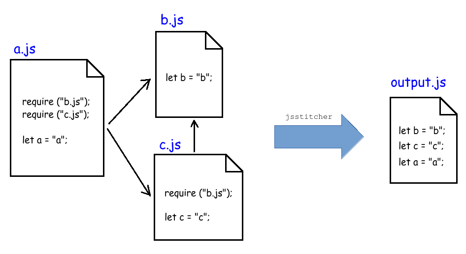

Jsstitcher is a simple tool to merge multiple javascript files into one single file.

It works like a C++ preprocessor on Javascript files.



# Install & Execute
Installation is not necessary

*Install*:
```
cd ./src
pip install .
```

*Execute*:
```jsstitcher inputfile.js > outputfile.js```


# No install & execute


```python3 PATH/TO/jsstitcher inputfile.js > outputfile.js```


# How to use

Within a javascript file, write the following to include files:

```
require ("<PATH TO ANOTHER FILE>")
```

To build run:
